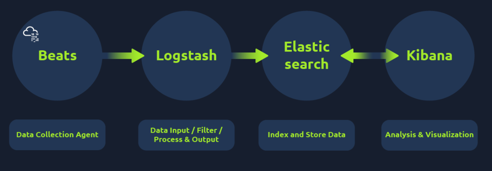

# Elastic Stack: The Basics
**Source:** TryHackMe — SOC Level 1 Path, Core SOC Solutions **Difficulty:** Medium

## Key Concepts

### Elastic Stack Overview — Elasticsearch, Logstash, Beats, Kibana
The Elastic Stack (ELK) was originally built to store, search, and visualize large volumes of data — log analysis and investigation is one use case among several (it's also used for things like application performance monitoring). It's a combination of open-source components that each handle one piece of the pipeline:

- **Beats** — host-based agents (data shippers) that transfer data from endpoints into Elasticsearch.
- **Logstash** — a data processing engine. Its config has three parts: input (where the data comes from), filter (how it's parsed or normalized), and output (where it's sent).
- **Elasticsearch** — a full-text search and analytics engine for JSON documents, with a RESTful API for interacting with it directly.
- **Kibana** — the web-based visualization layer that sits on top of Elasticsearch for real-time analysis and investigation.

ELK isn't a purpose-built SIEM, but the combination of these four pieces gets close enough to one that it's been widely adopted by SOC teams as a log-search and visualization platform.

### The Discover Tab
This is where an analyst spends most of their time day to day. It shows ingested logs, a search bar, and the normalized fields extracted from those logs. Kibana needs an index pattern to know which Elasticsearch dataset to pull from before any of that data is browsable — without selecting one, there's nothing to search against. Once an index pattern is selected, the left-hand pane lists the available normalized fields, which can be used to filter the view — functionally similar to the field list in Splunk's Search & Reporting app.

### KQL (Kibana Query Language)
The Discover tab's search bar runs on KQL, and there are two ways to use it:

- **Free text search** — searching across the raw log text directly, with support for wildcards and logical operators.
- **Field-based search** — filtering on the normalized fields, e.g. `Source_Country : "United States" AND UserName : "James" OR "Albert"` to pull logs from US-based connections for either of two named users.

Field-based search is the one that matters in practice — it's the difference between scanning raw text and actually narrowing a dataset down to what's relevant. One practical wrinkle that came up directly: querying by username alone isn't enough if the question is time-bound (e.g. "did this terminated employee's account show any VPN activity after their termination date") — the search also has to scope the time range correctly, or a query that should return zero results will pull in unrelated historical activity instead.

### Creating Visualizations
Kibana also supports building visualizations directly from indexed data — charts, graphs, and other views layered on top of the same fields used in Discover. This room didn't go deep into the visualization builder itself, but the existence of that layer is what pushes Kibana from "search tool" toward "dashboarding tool" — the same data an analyst filters in Discover can be turned into something a SOC lead glances at without running a query themselves.
