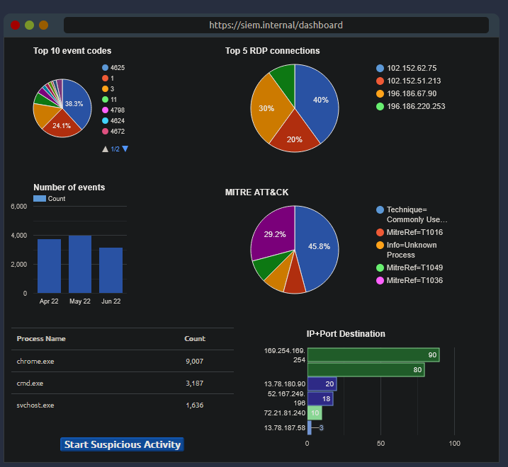

# Introduction to SIEM
**Source:** TryHackMe — SOC Level 1 Path, Core SOC Solutions **Difficulty:** Easy

## Overview
This room covers why a SIEM exists at all: every device on a network produces a constant stream of logs, and raw logs alone are unusable at scale. It walks through how a SIEM collects, normalizes, and correlates that data, then puts you in front of a simulated SIEM dashboard to triage a live alert.

## Key Concepts
- **Logs everywhere, answers nowhere** — nearly every connected device generates logs. These fall into two broad categories: host-centric log sources (events tied to a single host) and network-centric log sources (events generated when hosts communicate with each other, including over the internet). The volume is the problem — raw logs at this scale are effectively unsearchable by hand.
- **Why a SIEM** — a SIEM's job is to collect data from sources, aggregate it, detect threats, and surface breaches for investigation. Five core features carry that: centralized log collection, normalization (reformatting logs into a consistent structure with key fields pulled out, necessary because every log source formats things differently), correlation across sources, real-time alerting, and dashboards/reporting.
- **Log sources and ingestion** — different sources log differently: Windows machines rely on Event Viewer, Linux machines mostly write to `/var/log/`. SIEMs ingest this a few common ways: agent/forwarder (an installed agent ships logs to the SIEM server, similar to how EDR agents work), syslog (a widely used protocol for things like web servers and databases), manual upload (not a long-term solution, but useful in a pinch), and port-forwarding (the SIEM listens on a specific port and pulls the stream).
- **Alert process and analysis** — an alert is generated by a detection rule: logic (functionally similar to code) that correlates logs against known suspicious/malicious patterns. Once an alert fires, the analyst investigates within the SIEM and reaches a verdict. If it turns out to be a false positive, the rule itself may need tuning to narrow in on the actual malicious activity rather than over-firing.

## Situation
The room's lab puts you on a live SIEM dashboard. Triggering the "Start Suspicious Activity" button spawns a process, `cudominer.exe`, which fires an alert: **Potential CryptoMiner Activity**.



Clicking into the alert lands on the underlying event log: a 4688 (process creation) event observed on host `HR_02`, on May 6th 2022 at 00:40 PKT, under user `Chris`, with file path `C:\Users\Chris\temp\cudominer.exe`. Pulling up the rule logic behind the alert shows:

```
Alert "Potential CryptoMiner Activity" If EventID = 4688 AND Log_Source = WindowsEventLogs AND ProcessName = (*miner* OR *crypt*)
```

## Decision
The process name (`cudominer.exe`) directly matches the rule's `*miner*`/`*crypt*` pattern, the event itself is a legitimate process-creation event (4688) from the correct log source, and the file path puts it running out of a user's temp directory — not a location associated with any legitimate software. Given that, this is malicious in nature, and I'd escalate it as a true positive.
