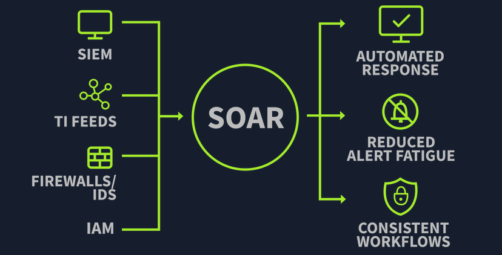

# Introduction to SOAR
**Source:** TryHackMe — SOC Level 1 Path, Core SOC Solutions **Difficulty:** Medium

## Key Concepts
- **Traditional SOC and challenges** — a SOC's core job spans monitoring/detection, recovery/remediation, threat intel, and cross-team communication. In practice, several recurring problems make that job harder: alert fatigue (too many alerts and false positives overwhelm analysts), disconnected tooling (separate, non-integrated tools make investigating a single alert slower instead of easier), manual processes (repetitive steps done by hand that drive up Mean Time to Respond), and a talent shortage (the field moves fast enough that finding analysts who can keep up is its own ongoing problem).
- **Overcoming SOC challenges with SOAR** — SOAR (Security Orchestration, Automation, and Response) exists to connect the SOC's disconnected tools, threat intel feeds, and processes into a single system, so the same data and actions don't have to be manually shuttled between platforms.

  

- **Building SOAR playbooks** — most of what a SOC does day to day is repetitive enough to automate, and the unit of that automation is a playbook: an "if this, then that" structure that defines exactly what the system does when a given condition is met.

## Situation
The room's practical is a threat intel integration workflow spread across five configuration screens, each with a set of toggles. The task is to decide, screen by screen, which actions should be automated and which should stay manual.

- **Case Ticket Management:** creation, assignment, communication/notifications, updates, and deletion.
- **Threat Intelligence:** fetching intel data, fetch intervals, retry handling on failed fetches, and alert deletion.
- **Data Extraction:** domain/IP/URL extraction vs. analysis of unknown or novel threats.
- **Reputation Checks:** pulling VirusTotal results vs. running sandbox tests and validating/confirming those results.
- **Course of Action:** blocking malicious domains/IPs/URLs and updating the case ticket vs. final analyst approval to act.

## Decision
Across all five screens, the same line holds: automate anything routine, repeatable, and reversible; leave anything destructive, novel, or requiring a judgment call to a human.

- **Case Ticket Management** — automate creation, assignment, communication, and updates. Leave deletion manual; permanently removing case data is the one action here you can't undo, so it needs a person making that call.
- **Threat Intelligence** — automate fetching, fetch intervals, and retry handling on failed fetches, since those are just keeping the pipeline fed. Leave alert deletion manual for the same reason as ticket deletion — losing intel data by mistake costs more than the time automation saves.
- **Data Extraction** — automate domain/IP/URL extraction; it's pattern matching against known indicator formats. Leave analysis of unknown or novel threats manual, since by definition there's no established pattern for the system to match against — that's exactly the judgment call an analyst exists to make.
- **Reputation Checks** — automate pulling the VirusTotal result; it's just a lookup. Leave sandbox testing and result validation manual, since interpreting an ambiguous or borderline result is a judgment call, not a lookup.
- **Course of Action** — automate blocking and the case ticket update once a verdict is reached. Leave the final approval to act with the analyst — enforcement actions have real impact on the network, so a human should be the one authorizing them even if the system already did the legwork to get there.
