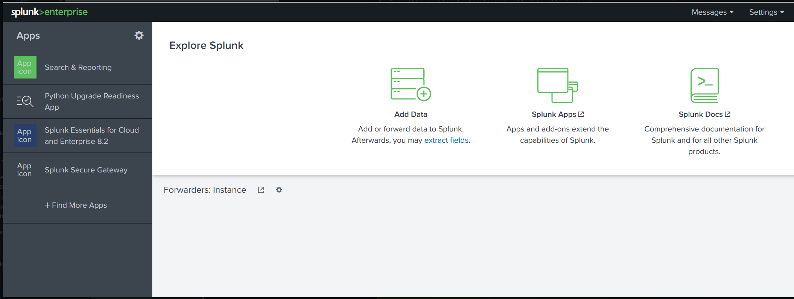

# Splunk: The Basics
**Source:** TryHackMe — SOC Level 1 Path, Core SOC Solutions **Difficulty:** Easy

## Key Concepts

### Splunk Components — Forwarder, Indexer, Search Head
Splunk's architecture splits into three pieces, each with a distinct job:
- **Forwarder** — a lightweight agent installed on the endpoint itself, responsible for collecting logs from that host and shipping them to Splunk.
- **Indexer** — receives what the forwarder sends, then normalizes and categorizes it, breaking raw log lines into structured field-value pairs and storing the result as searchable events.
- **Search head** — the layer analysts actually interact with, inside the "Search and Reporting" app, where SPL (Search Processing Language) is used to query the indexed events.

This matches how it actually works in practice, just simplified for the room's sake. The real-world version has more moving parts (multiple indexers in a cluster, forwarder management, deployment servers pushing config), but the core division of labor — collect, normalize/store, search — holds up exactly as taught.

### Navigating Splunk
The Splunk home screen is the entry point into all of this:

The Splunk Bar runs across the top and the Apps Panel sits on the left — from there, "Search & Reporting" is where actual querying happens, and "Add Data" is the on-ramp for getting logs in. The home screen itself can be customized with dashboards and reports, so a SOC can have at-a-glance views waiting before anyone runs a manual search.

### Adding Data
Splunk supports several ways to get data in. This room had you upload a set of VPN logs as a JSON file, which Splunk then processed into individual searchable events.

In practice, on the job, this kind of ingestion is handled by engineers, and it's almost always set up as a "monitor" against a live log source rather than a one-off manual upload. Manual upload is realistic as a stopgap or for a one-time investigation need, but it's not how an analyst typically gets data into the system day to day.

### SPL Field-Value Search Syntax
Once data lands in an index, querying it comes down to filtering on field-value pairs: `index="vpn_logs"` scopes a search to a dataset, and stacking conditions like `UserName="Maleena"` or `Source_ip="107.14.182.38"` narrows it down to specific events. Negation works the same way (`Source_Country!="France"`).

In a real environment, Splunk is usually the SIEM of record, so almost every investigation starts here — pulling raw logs and the surrounding context around whatever triggered the alert. The instinct that matters beyond just knowing the syntax: keep searches as specific as possible. A broad search over a large index is "expensive" — it consumes more processing time and resources than a scoped one, and at scale that difference matters.
